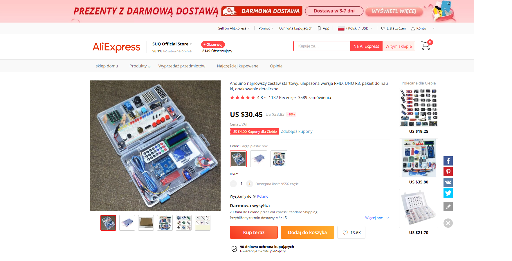
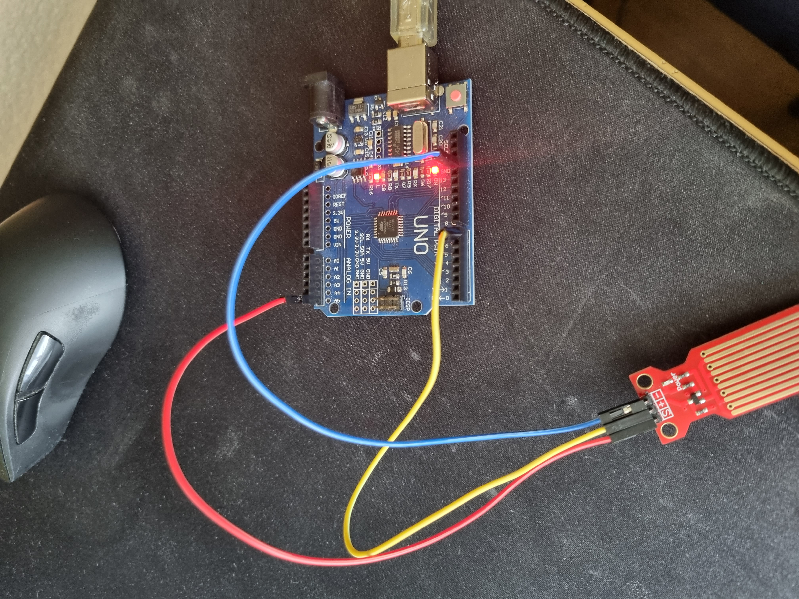
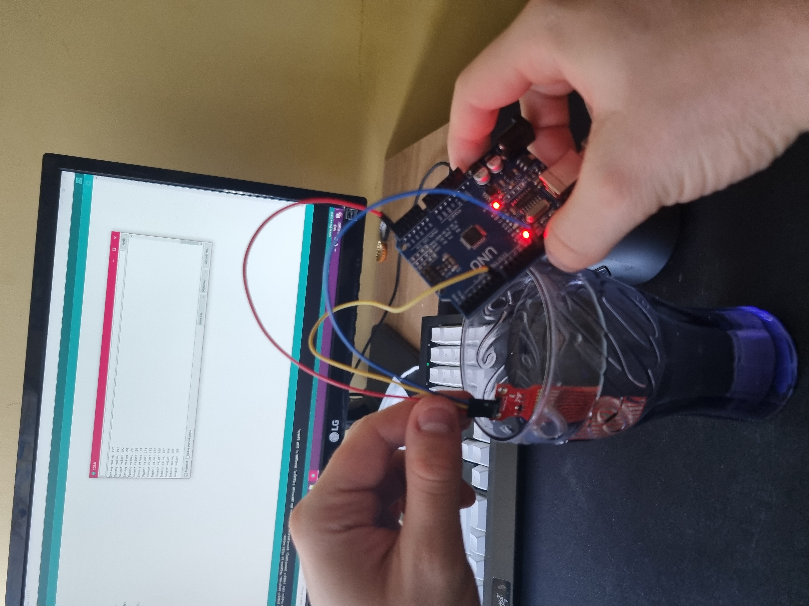

# Projekt

# #Wyświetlanie poziomu wody 

## Opis

Zamysłem projektu jest pomiar poziomu wody za pomocą czujnika

## Elementy

* 
* Czujnik poziomu wody
* Arduino UNO
	
## Links

## Budowa

Czujnik poziomu wody łączymy z arduino łącząc: S do A5, + do digital 7, i - do GND

## KOD

#define POWER_PIN  7
#define SIGNAL_PIN A5

int value = 0;

void setup() {
  Serial.begin(9600);
  pinMode(POWER_PIN, OUTPUT);
  digitalWrite(POWER_PIN, LOW);
}

void loop() {
  digitalWrite(POWER_PIN, HIGH); 
  delay(10);                     
  value = analogRead(SIGNAL_PIN);
  digitalWrite(POWER_PIN, LOW);

  Serial.print("Sensor value: ");
  Serial.println(value);

  delay(1000);
}